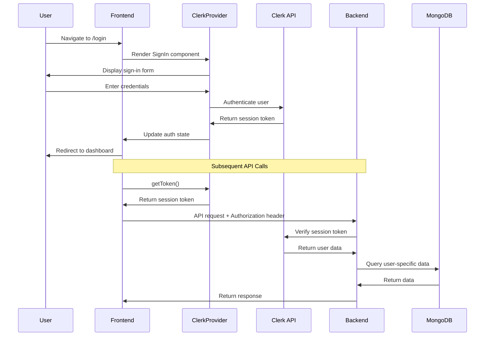
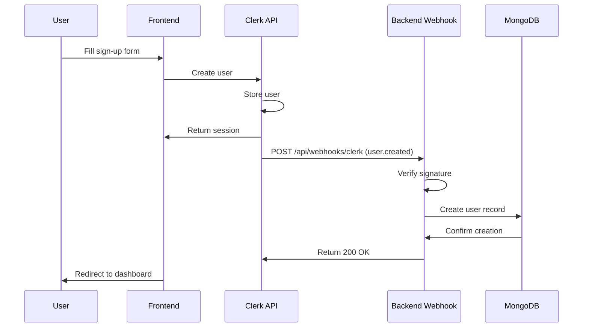
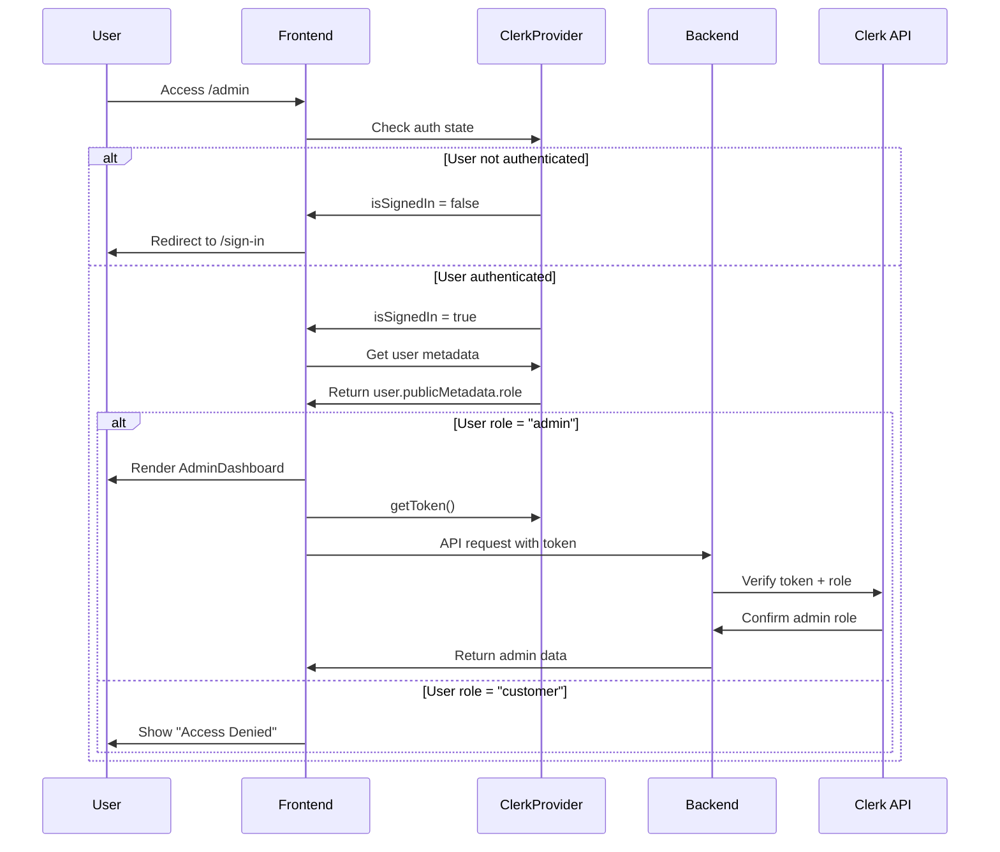

# Design Document: Clerk Authentication Migration

## Overview

This design document outlines the technical approach for migrating CS Smart Finserve from a custom authentication system to Clerk. The migration replaces Google OAuth + Passport.js + JWT + MongoDB user management with Clerk's managed authentication service while preserving all existing functionality including role-based access control, protected routes, and user profile management.

### Current Architecture

The application currently uses:
- **Frontend**: React 18 (Create React App) with custom AuthContext for state management
- **Backend**: Express.js with Passport.js for Google OAuth, JWT for session management
- **Database**: MongoDB for user storage with bcrypt password hashing
- **Deployment**: Vercel for both frontend and backend (serverless functions)

### Target Architecture

The migrated system will use:
- **Frontend**: React 18 with @clerk/clerk-react for authentication state
- **Backend**: Express.js with @clerk/clerk-sdk-node for session validation
- **Database**: MongoDB for application data only (users managed by Clerk)
- **User Management**: Clerk handles authentication, user storage, and session management
- **Deployment**: Vercel with Clerk webhooks for user synchronization

### Migration Benefits

1. **Reduced Complexity**: Eliminates custom authentication code, password management, and OAuth configuration
2. **Enhanced Security**: Clerk handles security best practices, token rotation, and breach detection
3. **Better UX**: Pre-built, accessible UI components with social login support
4. **Maintainability**: Offloads authentication maintenance to Clerk's managed service
5. **Scalability**: Clerk's infrastructure handles authentication load

## Architecture

### System Components

```
┌─────────────────────────────────────────────────────────────┐
│                     Frontend (React 18 CRA)                  │
│  ┌────────────────────────────────────────────────────────┐ │
│  │  ClerkProvider (wraps entire app)                      │ │
│  │  ├─ useAuth() hook → authentication state              │ │
│  │  ├─ useUser() hook → user profile data                 │ │
│  │  ├─ SignIn/SignUp components → auth UI                 │ │
│  │  ├─ SignedIn/SignedOut → conditional rendering         │ │
│  │  └─ getToken() → session tokens for API calls          │ │
│  └────────────────────────────────────────────────────────┘ │
└─────────────────────────────────────────────────────────────┘
                            │
                            │ HTTPS + Session Token
                            ↓
┌─────────────────────────────────────────────────────────────┐
│                  Backend API (Express/Vercel)                │
│  ┌────────────────────────────────────────────────────────┐ │
│  │  Clerk Middleware                                       │ │
│  │  ├─ Validates session tokens                           │ │
│  │  ├─ Extracts user data from Clerk                      │ │
│  │  ├─ Enforces role-based access control                 │ │
│  │  └─ Attaches user to req.user                          │ │
│  └────────────────────────────────────────────────────────┘ │
│  ┌────────────────────────────────────────────────────────┐ │
│  │  Webhook Endpoint (/api/webhooks/clerk)                │ │
│  │  ├─ Receives user.created events                       │ │
│  │  ├─ Receives user.updated events                       │ │
│  │  ├─ Receives user.deleted events                       │ │
│  │  └─ Syncs with MongoDB                                 │ │
│  └────────────────────────────────────────────────────────┘ │
└─────────────────────────────────────────────────────────────┘
                            │
                            │ Webhook Events
                            ↓
┌─────────────────────────────────────────────────────────────┐
│                      Clerk Service                           │
│  ├─ User Management                                         │
│  ├─ Authentication (email, Google, etc.)                    │
│  ├─ Session Management                                      │
│  ├─ Password Reset                                          │
│  └─ User Metadata (roles, preferences)                      │
└─────────────────────────────────────────────────────────────┘
```

### Authentication Flow

#### Sign-In Flow



#### Sign-Up Flow with Webhook Sync



#### Protected Route Access



## Components and Interfaces

### Frontend Components

#### 1. ClerkProvider Configuration (index.js)

```javascript
import { ClerkProvider } from '@clerk/clerk-react';

const clerkPubKey = process.env.REACT_APP_CLERK_PUBLISHABLE_KEY;

root.render(
  <ClerkProvider 
    publishableKey={clerkPubKey}
    appearance={{
      // Custom styling to match existing design
      variables: {
        colorPrimary: '#3b82f6',
        colorBackground: '#ffffff',
        colorText: '#1f2937'
      }
    }}
  >
    <App />
  </ClerkProvider>
);
```

#### 2. Authentication Components

**SignIn Component** (replaces Login.js):
```javascript
import { SignIn } from '@clerk/clerk-react';

export default function SignInPage() {
  return (
    <div className="auth-container">
      <SignIn 
        routing="path"
        path="/sign-in"
        signUpUrl="/sign-up"
        redirectUrl="/dashboard"
      />
    </div>
  );
}
```

**SignUp Component** (replaces Signup.js):
```javascript
import { SignUp } from '@clerk/clerk-react';

export default function SignUpPage() {
  return (
    <div className="auth-container">
      <SignUp 
        routing="path"
        path="/sign-up"
        signInUrl="/sign-in"
        redirectUrl="/dashboard"
      />
    </div>
  );
}
```

#### 3. Protected Route Component

```javascript
import { useAuth, RedirectToSignIn } from '@clerk/clerk-react';

export function ProtectedRoute({ children, requiredRole }) {
  const { isLoaded, isSignedIn, user } = useAuth();

  if (!isLoaded) {
    return <LoadingSpinner />;
  }

  if (!isSignedIn) {
    return <RedirectToSignIn />;
  }

  if (requiredRole && user.publicMetadata.role !== requiredRole) {
    return <AccessDenied />;
  }

  return children;
}
```

#### 4. Navbar Component Updates

```javascript
import { SignedIn, SignedOut, UserButton, useUser } from '@clerk/clerk-react';

export default function Navbar() {
  const { user } = useUser();
  const isAdmin = user?.publicMetadata?.role === 'admin';

  return (
    <nav>
      <SignedOut>
        <Link to="/sign-in">Login</Link>
        <Link to="/sign-up">Sign Up</Link>
      </SignedOut>
      
      <SignedIn>
        <Link to="/dashboard">Dashboard</Link>
        {isAdmin && <Link to="/admin">Admin</Link>}
        <UserButton afterSignOutUrl="/" />
      </SignedIn>
    </nav>
  );
}
```

#### 5. API Client Configuration

```javascript
import { useAuth } from '@clerk/clerk-react';
import axios from 'axios';

export function useAuthenticatedAPI() {
  const { getToken } = useAuth();

  const apiClient = axios.create({
    baseURL: process.env.REACT_APP_API_URL || '/api'
  });

  apiClient.interceptors.request.use(async (config) => {
    const token = await getToken();
    if (token) {
      config.headers.Authorization = `Bearer ${token}`;
    }
    return config;
  });

  return apiClient;
}
```

### Backend Components

#### 1. Clerk Middleware (replaces backend/middleware/auth.js)

```javascript
const { clerkClient } = require('@clerk/clerk-sdk-node');

exports.protect = async (req, res, next) => {
  try {
    const token = req.headers.authorization?.split(' ')[1];

    if (!token) {
      return res.status(401).json({
        success: false,
        message: 'Not authorized to access this route'
      });
    }

    // Verify token with Clerk
    const sessionClaims = await clerkClient.verifyToken(token);
    
    // Get full user data from Clerk
    const user = await clerkClient.users.getUser(sessionClaims.sub);

    // Attach user data to request
    req.user = {
      id: user.id,
      email: user.emailAddresses[0].emailAddress,
      name: `${user.firstName} ${user.lastName}`.trim(),
      role: user.publicMetadata.role || 'customer',
      clerkUser: user
    };

    next();
  } catch (error) {
    return res.status(401).json({
      success: false,
      message: 'Not authorized, token failed'
    });
  }
};

exports.authorize = (...roles) => {
  return (req, res, next) => {
    if (!roles.includes(req.user.role)) {
      return res.status(403).json({
        success: false,
        message: `User role ${req.user.role} is not authorized to access this route`
      });
    }
    next();
  };
};
```

#### 2. Webhook Handler

```javascript
const { Webhook } = require('svix');
const User = require('../models/User');

exports.handleClerkWebhook = async (req, res) => {
  try {
    const webhookSecret = process.env.CLERK_WEBHOOK_SECRET;
    
    // Verify webhook signature
    const wh = new Webhook(webhookSecret);
    const payload = wh.verify(
      JSON.stringify(req.body),
      req.headers
    );

    const eventType = payload.type;
    const userData = payload.data;

    switch (eventType) {
      case 'user.created':
        await User.create({
          clerkId: userData.id,
          email: userData.email_addresses[0].email_address,
          name: `${userData.first_name} ${userData.last_name}`.trim(),
          phone: userData.phone_numbers[0]?.phone_number || null,
          role: userData.public_metadata.role || 'customer',
          avatar: userData.image_url
        });
        break;

      case 'user.updated':
        await User.findOneAndUpdate(
          { clerkId: userData.id },
          {
            email: userData.email_addresses[0].email_address,
            name: `${userData.first_name} ${userData.last_name}`.trim(),
            phone: userData.phone_numbers[0]?.phone_number || null,
            role: userData.public_metadata.role || 'customer',
            avatar: userData.image_url
          }
        );
        break;

      case 'user.deleted':
        await User.findOneAndDelete({ clerkId: userData.id });
        break;
    }

    res.status(200).json({ success: true });
  } catch (error) {
    console.error('Webhook error:', error);
    res.status(400).json({ success: false, message: error.message });
  }
};
```

#### 3. Webhook Route Configuration

```javascript
const express = require('express');
const router = express.Router();
const { handleClerkWebhook } = require('../controllers/webhookController');

// Webhook endpoint must use raw body
router.post('/clerk', 
  express.raw({ type: 'application/json' }),
  handleClerkWebhook
);

module.exports = router;
```

## Data Models

### Updated User Model (MongoDB)

The User model will be simplified since Clerk handles authentication:

```javascript
const mongoose = require('mongoose');

const userSchema = new mongoose.Schema({
  clerkId: {
    type: String,
    required: true,
    unique: true,
    index: true
  },
  email: {
    type: String,
    required: true,
    unique: true,
    lowercase: true,
    trim: true
  },
  name: {
    type: String,
    required: true,
    trim: true
  },
  phone: {
    type: String,
    default: null
  },
  avatar: {
    type: String,
    default: null
  },
  role: {
    type: String,
    enum: ['customer', 'admin'],
    default: 'customer'
  },
  createdAt: {
    type: Date,
    default: Date.now
  },
  // Application-specific fields remain
  preferences: {
    notifications: { type: Boolean, default: true },
    theme: { type: String, default: 'light' }
  }
});

// Remove: password, googleId, resetPasswordToken, resetPasswordExpire
// Remove: password hashing middleware
// Remove: comparePassword method

module.exports = mongoose.model('User', userSchema);
```

### Clerk User Metadata Structure

Clerk stores user data in three metadata objects:

**publicMetadata** (readable by frontend and backend):
```json
{
  "role": "customer" | "admin",
  "onboardingComplete": true,
  "accountType": "individual" | "business"
}
```

**privateMetadata** (backend only):
```json
{
  "internalNotes": "VIP customer",
  "riskScore": 0,
  "lastLoginIP": "192.168.1.1"
}
```

**unsafeMetadata** (user-writable, not recommended for sensitive data):
```json
{
  "preferences": {
    "theme": "dark",
    "language": "en"
  }
}
```

### Data Relationships

```
Clerk User (Clerk Platform)
    ↓ clerkId
MongoDB User (Application Database)
    ↓ userId (foreign key)
├── Applications
├── Appointments
├── Documents
├── Notifications
└── Feedback
```

All existing relationships (applications, appointments, documents) remain unchanged. The MongoDB User document serves as a local cache and relationship anchor.


## Migration Strategy

### Phase 1: Preparation

1. **Install Dependencies**
   ```bash
   # Frontend
   cd frontend
   npm install @clerk/clerk-react
   
   # Backend
   cd backend
   npm install @clerk/clerk-sdk-node svix
   ```

2. **Configure Environment Variables**
   
   Frontend (.env):
   ```
   REACT_APP_CLERK_PUBLISHABLE_KEY=pk_test_...
   ```
   
   Backend (.env):
   ```
   CLERK_SECRET_KEY=sk_test_...
   CLERK_WEBHOOK_SECRET=whsec_...
   ```

3. **Create Clerk Application**
   - Sign up at clerk.com
   - Create new application
   - Enable email + Google authentication
   - Configure redirect URLs
   - Generate API keys

### Phase 2: User Data Migration

**Migration Script** (backend/scripts/migrateToClerk.js):

```javascript
const { clerkClient } = require('@clerk/clerk-sdk-node');
const User = require('../models/User');
const mongoose = require('mongoose');

async function migrateUsers() {
  await mongoose.connect(process.env.MONGODB_URI);
  
  const users = await User.find({}).select('+password');
  const results = { success: 0, failed: 0, skipped: 0, errors: [] };

  for (const user of users) {
    try {
      // Check if user already exists in Clerk
      const existingUsers = await clerkClient.users.getUserList({
        emailAddress: [user.email]
      });

      if (existingUsers.length > 0) {
        console.log(`Skipping ${user.email} - already exists in Clerk`);
        results.skipped++;
        continue;
      }

      // Create user in Clerk
      const clerkUser = await clerkClient.users.createUser({
        emailAddress: [user.email],
        firstName: user.name.split(' ')[0],
        lastName: user.name.split(' ').slice(1).join(' ') || '',
        phoneNumber: user.phone ? [user.phone] : [],
        publicMetadata: {
          role: user.role === 'admin' ? 'admin' : 'customer'
        },
        // If user has Google OAuth, skip password
        ...(user.googleId ? {} : {
          password: generateTemporaryPassword()
        })
      });

      // Update MongoDB user with Clerk ID
      user.clerkId = clerkUser.id;
      await user.save();

      console.log(`✓ Migrated ${user.email}`);
      results.success++;

    } catch (error) {
      console.error(`✗ Failed to migrate ${user.email}:`, error.message);
      results.failed++;
      results.errors.push({ email: user.email, error: error.message });
    }
  }

  console.log('\n=== Migration Summary ===');
  console.log(`Success: ${results.success}`);
  console.log(`Failed: ${results.failed}`);
  console.log(`Skipped: ${results.skipped}`);
  
  if (results.errors.length > 0) {
    console.log('\nErrors:');
    results.errors.forEach(e => console.log(`  ${e.email}: ${e.error}`));
  }

  await mongoose.disconnect();
}

function generateTemporaryPassword() {
  // Generate secure temporary password
  return Math.random().toString(36).slice(-12) + 
         Math.random().toString(36).slice(-12).toUpperCase() + 
         '!@#';
}

migrateUsers().catch(console.error);
```

**Migration Execution Plan**:

1. **Backup Database**: Create MongoDB backup before migration
2. **Test Migration**: Run script on staging environment with test data
3. **Dry Run**: Execute script with logging only (no actual creation)
4. **Production Migration**: Run during low-traffic period
5. **Notify Users**: Send email to users with temporary passwords (if applicable)
6. **Monitor**: Watch for authentication errors post-migration

### Phase 3: Frontend Migration

**Step-by-step implementation**:

1. **Install ClerkProvider** (index.js)
2. **Replace Login/Signup pages** with Clerk components
3. **Update Navbar** with SignedIn/SignedOut components
4. **Replace useAuth hook** calls with Clerk hooks
5. **Update protected routes** with Clerk authentication checks
6. **Update API client** to use Clerk tokens
7. **Remove AuthContext** and related files
8. **Test all authentication flows**

### Phase 4: Backend Migration

**Step-by-step implementation**:

1. **Create new auth middleware** using Clerk SDK
2. **Create webhook endpoint** for user sync
3. **Update all protected routes** to use new middleware
4. **Remove old auth routes** (login, signup, Google OAuth)
5. **Remove authController.js**
6. **Remove passport.js configuration**
7. **Update User model** (remove password fields)
8. **Test all API endpoints**

### Phase 5: Cleanup

1. **Remove unused packages**:
   ```bash
   npm uninstall passport passport-google-oauth20 bcryptjs jsonwebtoken
   ```

2. **Remove files**:
   - frontend/src/context/AuthContext.js
   - frontend/src/pages/Login.js (replaced)
   - frontend/src/pages/Signup.js (replaced)
   - frontend/src/pages/GoogleAuthSuccess.js
   - frontend/src/pages/ForgotPassword.js
   - frontend/src/pages/ResetPassword.js
   - backend/controllers/authController.js
   - backend/config/passport.js

3. **Update documentation**
4. **Remove environment variables**: GOOGLE_CLIENT_ID, GOOGLE_CLIENT_SECRET, JWT_SECRET

### Rollback Plan

If critical issues arise:

1. **Revert deployment** to previous version
2. **Restore MongoDB backup** if data was modified
3. **Re-enable old authentication routes**
4. **Investigate and fix issues**
5. **Re-attempt migration** after fixes

## Environment Configuration

### Create React App Configuration

CRA requires environment variables to be prefixed with `REACT_APP_`:

**frontend/.env**:
```
REACT_APP_CLERK_PUBLISHABLE_KEY=pk_test_...
REACT_APP_API_URL=http://localhost:5001/api
```

**frontend/.env.production**:
```
REACT_APP_CLERK_PUBLISHABLE_KEY=pk_live_...
REACT_APP_API_URL=/api
```

### Backend Configuration

**backend/.env**:
```
CLERK_SECRET_KEY=sk_test_...
CLERK_WEBHOOK_SECRET=whsec_...
MONGODB_URI=mongodb+srv://...
CLIENT_URL=http://localhost:3000
```

### Vercel Configuration

**Frontend Environment Variables** (Vercel Dashboard):
```
REACT_APP_CLERK_PUBLISHABLE_KEY = pk_live_...
```

**Backend Environment Variables** (Vercel Dashboard):
```
CLERK_SECRET_KEY = sk_live_...
CLERK_WEBHOOK_SECRET = whsec_...
MONGODB_URI = mongodb+srv://...
CLIENT_URL = https://your-domain.vercel.app
```

**Webhook Configuration** (Clerk Dashboard):
```
Endpoint URL: https://your-api.vercel.app/api/webhooks/clerk
Events: user.created, user.updated, user.deleted
```

### Build Configuration

No changes needed to existing build configuration. CRA handles environment variables automatically during build.

**vercel.json** (if needed):
```json
{
  "builds": [
    {
      "src": "package.json",
      "use": "@vercel/static-build",
      "config": {
        "distDir": "build"
      }
    }
  ],
  "routes": [
    {
      "src": "/static/(.*)",
      "dest": "/static/$1"
    },
    {
      "src": "/(.*)",
      "dest": "/index.html"
    }
  ]
}
```


## Correctness Properties

*A property is a characteristic or behavior that should hold true across all valid executions of a system—essentially, a formal statement about what the system should do. Properties serve as the bridge between human-readable specifications and machine-verifiable correctness guarantees.*

### Property Reflection

After analyzing all acceptance criteria, I identified the following testable properties and examples. Before finalizing, I performed redundancy analysis:

**Redundancy Analysis**:
- Properties 4.4 (unauthenticated redirect) and 6.4/6.5 (middleware 401 responses) test similar concepts but at different layers (frontend vs backend), so both are valuable
- Properties 5.4 and 5.5 (customer/admin access examples) could be combined into a single property about role-based access, but keeping them as separate examples provides clearer test cases
- Properties 7.3, 7.4, 7.5 (webhook event handling) are distinct event types and should remain separate examples
- Properties 13.1-13.6 (maintaining existing features) test different features and should remain separate
- Property 6.3 (valid token attaches user data) and 15.2 (requests include token) are complementary (backend vs frontend) and both needed

**Consolidated Properties**:
- Combined 5.4 and 5.5 into a single property about role-based access control
- Combined 13.3, 13.4, 13.5, 13.6 into a single property about authenticated feature access
- Kept 7.3, 7.4, 7.5 as separate examples since they test distinct webhook event types

### Property 1: Successful Authentication Redirects to Home

*For any* user who successfully completes authentication (sign-in or sign-up), the application should redirect them to the home page or dashboard.

**Validates: Requirements 3.6**

### Property 2: Unauthenticated Access to Protected Routes Redirects

*For any* protected route in the application, when an unauthenticated user attempts to access it, the application should redirect them to the sign-in page.

**Validates: Requirements 4.4**

### Property 3: New Users Receive Default Customer Role

*For any* newly created user account, the system should automatically assign the "customer" role as the default User_Role.

**Validates: Requirements 5.2**

### Property 4: Role-Based Access Control Enforcement

*For any* user and any route, the application should grant access if and only if the user's role matches the route's required role (admin routes require admin role, customer routes allow customer or admin roles).

**Validates: Requirements 5.4, 5.5**

### Property 5: Navigation Displays Role-Appropriate Elements

*For any* authenticated user, the navigation menu should display only the links and UI elements appropriate for that user's role (admin users see admin links, customer users do not).

**Validates: Requirements 5.6**

### Property 6: Valid Session Tokens Attach User Data

*For any* valid Clerk session token provided to the backend middleware, the middleware should successfully verify the token and attach the corresponding user data to the request object.

**Validates: Requirements 6.3**

### Property 7: Invalid Session Tokens Return 401

*For any* invalid or malformed session token provided to the backend middleware, the middleware should reject the request and return a 401 Unauthorized response.

**Validates: Requirements 6.4**

### Property 8: Role-Based Endpoint Protection

*For any* role-protected API endpoint, the middleware should verify the user's role from Clerk metadata and grant access only if the user's role matches the endpoint's required role.

**Validates: Requirements 6.6**

### Property 9: Webhook Signature Verification

*For any* webhook request received at the Clerk webhook endpoint, the system should verify the webhook signature, and reject any request with an invalid signature by returning a 400 Bad Request response.

**Validates: Requirements 7.2, 7.6**

### Property 10: User Profile Data Display

*For any* authenticated user viewing their profile, the application should display the user's name, email, and phone number exactly as stored in their Clerk user object.

**Validates: Requirements 10.2**

### Property 11: Authenticated Feature Access Maintained

*For any* authenticated user, all existing application features (loan applications, appointments, document uploads, notifications) should remain accessible and functional with Clerk authentication.

**Validates: Requirements 13.3, 13.4, 13.5, 13.6**

### Property 12: User-Specific Data Display

*For any* authenticated user, when they log in, the application should display only their own user-specific data (applications, appointments, documents) and not data belonging to other users.

**Validates: Requirements 13.7**

### Property 13: Authentication State Changes Update UI

*For any* change in authentication state (sign-in, sign-out, session expiration), the application UI should update immediately to reflect the new state.

**Validates: Requirements 14.2**

### Property 14: Logout Clears User Data

*For any* user who logs out, the application should clear all user-specific data from the client-side state and storage.

**Validates: Requirements 14.3**

### Property 15: Protected Endpoints Receive Authorization Headers

*For any* API request to a protected endpoint, the frontend should automatically include the Clerk session token in the Authorization header.

**Validates: Requirements 15.2**

### Example Test Cases

The following are specific example test cases for particular scenarios:

**Example 1: Customer Access to Admin Routes Denied**
- Given a user with role "customer"
- When they attempt to access /admin route
- Then the application should display "Access Denied" or redirect

**Validates: Requirements 5.4**

**Example 2: Admin Access to Admin Routes Granted**
- Given a user with role "admin"
- When they access /admin route
- Then the application should render the AdminDashboard

**Validates: Requirements 5.5**

**Example 3: Missing Session Token Returns 401**
- Given a request to a protected endpoint
- When no Authorization header is provided
- Then the middleware should return 401 Unauthorized

**Validates: Requirements 6.5**

**Example 4: Webhook user.created Event Creates MongoDB Record**
- Given a valid webhook request with event type "user.created"
- When the webhook endpoint processes the request
- Then a corresponding user record should be created in MongoDB

**Validates: Requirements 7.3**

**Example 5: Webhook user.updated Event Updates MongoDB Record**
- Given a valid webhook request with event type "user.updated"
- When the webhook endpoint processes the request
- Then the corresponding user record in MongoDB should be updated

**Validates: Requirements 7.4**

**Example 6: Webhook user.deleted Event Deletes MongoDB Record**
- Given a valid webhook request with event type "user.deleted"
- When the webhook endpoint processes the request
- Then the corresponding user record should be deleted from MongoDB

**Validates: Requirements 7.5**

**Example 7: Forgot Password Displays Clerk UI**
- Given a user on the sign-in page
- When they click "Forgot Password"
- Then the application should display Clerk's password reset UI

**Validates: Requirements 9.4**

**Example 8: Customer Dashboard Access Maintained**
- Given an authenticated user with role "customer"
- When they navigate to /dashboard
- Then the CustomerDashboard should render with their data

**Validates: Requirements 13.1**

**Example 9: Admin Dashboard Access Maintained**
- Given an authenticated user with role "admin"
- When they navigate to /admin
- Then the AdminDashboard should render with admin data

**Validates: Requirements 13.2**

**Example 10: Clerk Initialization Shows Loading**
- Given the application is starting up
- When Clerk is initializing (isLoaded = false)
- Then the application should display a loading indicator

**Validates: Requirements 14.1**

**Example 11: Logout Redirects to Home**
- Given an authenticated user
- When they log out
- Then the application should redirect them to the home page

**Validates: Requirements 14.4**

**Example 12: Token Refresh Failure Redirects to Sign-In**
- Given a user with an expired session
- When token refresh fails
- Then the application should redirect the user to the sign-in page

**Validates: Requirements 15.5**

**Example 13: Auth State Loads on Mount**
- Given a user who was previously authenticated
- When the application mounts
- Then Clerk should load the authentication state and the user should remain signed in

**Validates: Requirements 2.3**


## Error Handling

### Frontend Error Scenarios

#### 1. Clerk Initialization Failure

**Scenario**: Clerk fails to initialize due to invalid publishable key or network issues.

**Handling**:
```javascript
import { useClerk } from '@clerk/clerk-react';

function App() {
  const { loaded, error } = useClerk();

  if (error) {
    return (
      <ErrorBoundary>
        <div className="error-container">
          <h2>Authentication Service Unavailable</h2>
          <p>Please try refreshing the page. If the problem persists, contact support.</p>
          <button onClick={() => window.location.reload()}>Retry</button>
        </div>
      </ErrorBoundary>
    );
  }

  if (!loaded) {
    return <LoadingSpinner />;
  }

  return <AppContent />;
}
```

#### 2. Session Token Retrieval Failure

**Scenario**: Frontend cannot retrieve session token from Clerk.

**Handling**:
```javascript
export function useAuthenticatedAPI() {
  const { getToken, signOut } = useAuth();

  const apiClient = axios.create({
    baseURL: process.env.REACT_APP_API_URL || '/api'
  });

  apiClient.interceptors.request.use(
    async (config) => {
      try {
        const token = await getToken();
        if (token) {
          config.headers.Authorization = `Bearer ${token}`;
        }
        return config;
      } catch (error) {
        console.error('Failed to get token:', error);
        // Sign out user if token retrieval fails
        await signOut();
        window.location.href = '/sign-in';
        throw error;
      }
    },
    (error) => Promise.reject(error)
  );

  return apiClient;
}
```

#### 3. Unauthorized API Response

**Scenario**: Backend returns 401, indicating invalid or expired session.

**Handling**:
```javascript
apiClient.interceptors.response.use(
  (response) => response,
  async (error) => {
    if (error.response?.status === 401) {
      // Clear auth state and redirect to sign-in
      await signOut();
      toast.error('Your session has expired. Please sign in again.');
      window.location.href = '/sign-in';
    }
    return Promise.reject(error);
  }
);
```

#### 4. Role-Based Access Denial

**Scenario**: User attempts to access route they don't have permission for.

**Handling**:
```javascript
function ProtectedRoute({ children, requiredRole }) {
  const { isLoaded, isSignedIn, user } = useAuth();

  if (!isLoaded) return <LoadingSpinner />;
  if (!isSignedIn) return <RedirectToSignIn />;

  const userRole = user.publicMetadata.role;
  
  if (requiredRole && userRole !== requiredRole) {
    return (
      <div className="access-denied">
        <h2>Access Denied</h2>
        <p>You don't have permission to access this page.</p>
        <Link to="/dashboard">Return to Dashboard</Link>
      </div>
    );
  }

  return children;
}
```

### Backend Error Scenarios

#### 1. Invalid Session Token

**Scenario**: Request contains invalid, malformed, or expired token.

**Handling**:
```javascript
exports.protect = async (req, res, next) => {
  try {
    const token = req.headers.authorization?.split(' ')[1];

    if (!token) {
      return res.status(401).json({
        success: false,
        message: 'Authentication required',
        code: 'NO_TOKEN'
      });
    }

    try {
      const sessionClaims = await clerkClient.verifyToken(token);
      const user = await clerkClient.users.getUser(sessionClaims.sub);

      req.user = {
        id: user.id,
        email: user.emailAddresses[0].emailAddress,
        name: `${user.firstName} ${user.lastName}`.trim(),
        role: user.publicMetadata.role || 'customer',
        clerkUser: user
      };

      next();
    } catch (verifyError) {
      return res.status(401).json({
        success: false,
        message: 'Invalid or expired token',
        code: 'INVALID_TOKEN'
      });
    }
  } catch (error) {
    console.error('Auth middleware error:', error);
    return res.status(500).json({
      success: false,
      message: 'Authentication service error',
      code: 'AUTH_SERVICE_ERROR'
    });
  }
};
```

#### 2. Clerk API Unavailable

**Scenario**: Clerk service is down or unreachable.

**Handling**:
```javascript
const clerkClient = require('@clerk/clerk-sdk-node');

// Implement retry logic with exponential backoff
async function verifyTokenWithRetry(token, maxRetries = 3) {
  for (let attempt = 1; attempt <= maxRetries; attempt++) {
    try {
      return await clerkClient.verifyToken(token);
    } catch (error) {
      if (attempt === maxRetries) {
        throw new Error('Clerk service unavailable');
      }
      // Exponential backoff: 100ms, 200ms, 400ms
      await new Promise(resolve => setTimeout(resolve, 100 * Math.pow(2, attempt - 1)));
    }
  }
}
```

#### 3. Webhook Signature Verification Failure

**Scenario**: Webhook request has invalid signature (potential security threat).

**Handling**:
```javascript
exports.handleClerkWebhook = async (req, res) => {
  try {
    const webhookSecret = process.env.CLERK_WEBHOOK_SECRET;
    
    if (!webhookSecret) {
      console.error('CLERK_WEBHOOK_SECRET not configured');
      return res.status(500).json({ 
        success: false, 
        message: 'Webhook not configured' 
      });
    }

    const wh = new Webhook(webhookSecret);
    
    let payload;
    try {
      payload = wh.verify(JSON.stringify(req.body), req.headers);
    } catch (verifyError) {
      console.error('Webhook signature verification failed:', verifyError);
      return res.status(400).json({ 
        success: false, 
        message: 'Invalid webhook signature',
        code: 'INVALID_SIGNATURE'
      });
    }

    // Process webhook...
    
  } catch (error) {
    console.error('Webhook processing error:', error);
    return res.status(500).json({ 
      success: false, 
      message: 'Webhook processing failed' 
    });
  }
};
```

#### 4. MongoDB Sync Failure

**Scenario**: Webhook receives event but fails to sync with MongoDB.

**Handling**:
```javascript
switch (eventType) {
  case 'user.created':
    try {
      await User.create({
        clerkId: userData.id,
        email: userData.email_addresses[0].email_address,
        name: `${userData.first_name} ${userData.last_name}`.trim(),
        role: userData.public_metadata.role || 'customer'
      });
      console.log(`✓ Created user ${userData.id} in MongoDB`);
    } catch (dbError) {
      // Log error but return 200 to prevent Clerk from retrying
      // (duplicate key errors are expected if webhook is retried)
      if (dbError.code === 11000) {
        console.log(`User ${userData.id} already exists in MongoDB`);
      } else {
        console.error(`Failed to create user ${userData.id}:`, dbError);
        // Could implement dead letter queue here for manual review
      }
    }
    break;
}

// Always return 200 to acknowledge receipt
res.status(200).json({ success: true });
```

#### 5. Role Verification Failure

**Scenario**: User's role metadata is missing or invalid.

**Handling**:
```javascript
exports.authorize = (...roles) => {
  return (req, res, next) => {
    const userRole = req.user.role;

    if (!userRole) {
      return res.status(403).json({
        success: false,
        message: 'User role not configured',
        code: 'NO_ROLE'
      });
    }

    if (!roles.includes(userRole)) {
      return res.status(403).json({
        success: false,
        message: `Access denied for role: ${userRole}`,
        code: 'INSUFFICIENT_PERMISSIONS'
      });
    }

    next();
  };
};
```

### Error Monitoring and Logging

Implement comprehensive error logging for production debugging:

```javascript
// Backend error logger
const logAuthError = (context, error, metadata = {}) => {
  console.error({
    timestamp: new Date().toISOString(),
    context,
    error: {
      message: error.message,
      stack: error.stack,
      code: error.code
    },
    metadata,
    environment: process.env.NODE_ENV
  });

  // In production, send to monitoring service (e.g., Sentry, LogRocket)
  if (process.env.NODE_ENV === 'production') {
    // Sentry.captureException(error, { contexts: { auth: metadata } });
  }
};
```


## Testing Strategy

### Dual Testing Approach

This migration requires both unit tests and property-based tests to ensure comprehensive coverage:

- **Unit Tests**: Verify specific examples, edge cases, error conditions, and integration points
- **Property-Based Tests**: Verify universal properties across all inputs through randomization

Together, these approaches provide comprehensive coverage where unit tests catch concrete bugs and property-based tests verify general correctness.

### Property-Based Testing Configuration

**Library Selection**: 
- **Frontend**: Use `@fast-check/jest` for React component and integration testing
- **Backend**: Use `fast-check` for Node.js/Express middleware and API testing

**Installation**:
```bash
# Frontend
cd frontend
npm install --save-dev fast-check @fast-check/jest

# Backend
cd backend
npm install --save-dev fast-check
```

**Configuration Requirements**:
- Each property test MUST run minimum 100 iterations (due to randomization)
- Each property test MUST reference its design document property in a comment
- Tag format: `// Feature: clerk-auth-migration, Property {number}: {property_text}`

### Frontend Testing

#### Unit Tests (Jest + React Testing Library)

**Test File**: `frontend/src/__tests__/auth/ClerkIntegration.test.js`

```javascript
import { render, screen, waitFor } from '@testing-library/react';
import { ClerkProvider } from '@clerk/clerk-react';
import { BrowserRouter } from 'react-router-dom';
import App from '../App';

describe('Clerk Authentication Integration', () => {
  // Example 1: Customer Access to Admin Routes Denied
  test('customer users cannot access admin routes', async () => {
    const mockUser = {
      id: 'user_123',
      publicMetadata: { role: 'customer' }
    };

    render(
      <ClerkProvider publishableKey="test_key">
        <BrowserRouter>
          <App />
        </BrowserRouter>
      </ClerkProvider>
    );

    // Navigate to /admin
    window.history.pushState({}, '', '/admin');

    await waitFor(() => {
      expect(screen.getByText(/access denied/i)).toBeInTheDocument();
    });
  });

  // Example 2: Admin Access to Admin Routes Granted
  test('admin users can access admin routes', async () => {
    const mockUser = {
      id: 'user_123',
      publicMetadata: { role: 'admin' }
    };

    // Test implementation...
  });

  // Example 10: Clerk Initialization Shows Loading
  test('displays loading indicator during Clerk initialization', () => {
    const { container } = render(
      <ClerkProvider publishableKey="test_key">
        <App />
      </ClerkProvider>
    );

    expect(screen.getByTestId('loading-spinner')).toBeInTheDocument();
  });

  // Example 11: Logout Redirects to Home
  test('logout redirects user to home page', async () => {
    // Test implementation...
  });
});
```

#### Property-Based Tests (fast-check)

**Test File**: `frontend/src/__tests__/auth/ClerkProperties.test.js`

```javascript
import fc from 'fast-check';
import { renderHook } from '@testing-library/react-hooks';
import { useAuth } from '@clerk/clerk-react';

describe('Clerk Authentication Properties', () => {
  // Feature: clerk-auth-migration, Property 2: Unauthenticated Access to Protected Routes Redirects
  test('unauthenticated users are redirected from all protected routes', () => {
    fc.assert(
      fc.property(
        fc.constantFrom('/dashboard', '/admin', '/profile', '/appointments', '/documents'),
        (protectedRoute) => {
          // Mock unauthenticated state
          const { result } = renderHook(() => useAuth(), {
            wrapper: ({ children }) => (
              <ClerkProvider publishableKey="test_key">
                {children}
              </ClerkProvider>
            )
          });

          // Verify redirect behavior
          expect(result.current.isSignedIn).toBe(false);
          // Navigate to protected route and verify redirect
          // Implementation depends on routing setup
        }
      ),
      { numRuns: 100 }
    );
  });

  // Feature: clerk-auth-migration, Property 5: Navigation Displays Role-Appropriate Elements
  test('navigation shows only role-appropriate links for any user', () => {
    fc.assert(
      fc.property(
        fc.record({
          id: fc.string(),
          role: fc.constantFrom('customer', 'admin')
        }),
        (user) => {
          const { container } = render(
            <ClerkProvider publishableKey="test_key">
              <Navbar />
            </ClerkProvider>
          );

          const adminLink = container.querySelector('[href="/admin"]');
          
          if (user.role === 'admin') {
            expect(adminLink).toBeInTheDocument();
          } else {
            expect(adminLink).not.toBeInTheDocument();
          }
        }
      ),
      { numRuns: 100 }
    );
  });

  // Feature: clerk-auth-migration, Property 13: Authentication State Changes Update UI
  test('UI updates immediately for any auth state change', () => {
    fc.assert(
      fc.property(
        fc.boolean(), // isSignedIn state
        (isSignedIn) => {
          // Test that UI reflects auth state immediately
          // Implementation...
        }
      ),
      { numRuns: 100 }
    );
  });

  // Feature: clerk-auth-migration, Property 15: Protected Endpoints Receive Authorization Headers
  test('all protected endpoint requests include authorization header', () => {
    fc.assert(
      fc.property(
        fc.constantFrom('/api/applications', '/api/appointments', '/api/documents', '/api/user'),
        fc.string(), // session token
        async (endpoint, token) => {
          const apiClient = useAuthenticatedAPI();
          
          // Mock getToken to return test token
          jest.spyOn(useAuth(), 'getToken').mockResolvedValue(token);

          const request = await apiClient.get(endpoint);
          
          expect(request.config.headers.Authorization).toBe(`Bearer ${token}`);
        }
      ),
      { numRuns: 100 }
    );
  });
});
```

### Backend Testing

#### Unit Tests (Jest + Supertest)

**Test File**: `backend/__tests__/middleware/clerkAuth.test.js`

```javascript
const request = require('supertest');
const app = require('../../server');
const { clerkClient } = require('@clerk/clerk-sdk-node');

jest.mock('@clerk/clerk-sdk-node');

describe('Clerk Authentication Middleware', () => {
  // Example 3: Missing Session Token Returns 401
  test('returns 401 when no authorization header provided', async () => {
    const response = await request(app)
      .get('/api/user/profile')
      .expect(401);

    expect(response.body).toMatchObject({
      success: false,
      message: 'Authentication required',
      code: 'NO_TOKEN'
    });
  });

  // Example 4: Webhook user.created Event Creates MongoDB Record
  test('webhook creates MongoDB record on user.created event', async () => {
    const webhookPayload = {
      type: 'user.created',
      data: {
        id: 'user_123',
        email_addresses: [{ email_address: 'test@example.com' }],
        first_name: 'John',
        last_name: 'Doe',
        public_metadata: { role: 'customer' }
      }
    };

    const response = await request(app)
      .post('/api/webhooks/clerk')
      .send(webhookPayload)
      .set('svix-id', 'msg_123')
      .set('svix-timestamp', Date.now().toString())
      .set('svix-signature', 'valid_signature')
      .expect(200);

    // Verify user was created in MongoDB
    const user = await User.findOne({ clerkId: 'user_123' });
    expect(user).toBeTruthy();
    expect(user.email).toBe('test@example.com');
  });

  // Example 5: Webhook user.updated Event Updates MongoDB Record
  test('webhook updates MongoDB record on user.updated event', async () => {
    // Test implementation...
  });

  // Example 6: Webhook user.deleted Event Deletes MongoDB Record
  test('webhook deletes MongoDB record on user.deleted event', async () => {
    // Test implementation...
  });
});
```

#### Property-Based Tests (fast-check)

**Test File**: `backend/__tests__/middleware/clerkAuthProperties.test.js`

```javascript
const fc = require('fast-check');
const { protect, authorize } = require('../../middleware/auth');
const { clerkClient } = require('@clerk/clerk-sdk-node');

jest.mock('@clerk/clerk-sdk-node');

describe('Clerk Authentication Middleware Properties', () => {
  // Feature: clerk-auth-migration, Property 6: Valid Session Tokens Attach User Data
  test('valid tokens always attach user data to request', async () => {
    await fc.assert(
      fc.asyncProperty(
        fc.record({
          id: fc.string(),
          email: fc.emailAddress(),
          firstName: fc.string(),
          lastName: fc.string(),
          role: fc.constantFrom('customer', 'admin')
        }),
        async (userData) => {
          // Mock Clerk verification
          clerkClient.verifyToken.mockResolvedValue({ sub: userData.id });
          clerkClient.users.getUser.mockResolvedValue({
            id: userData.id,
            emailAddresses: [{ emailAddress: userData.email }],
            firstName: userData.firstName,
            lastName: userData.lastName,
            publicMetadata: { role: userData.role }
          });

          const req = {
            headers: { authorization: 'Bearer valid_token' }
          };
          const res = {};
          const next = jest.fn();

          await protect(req, res, next);

          expect(req.user).toBeDefined();
          expect(req.user.id).toBe(userData.id);
          expect(req.user.email).toBe(userData.email);
          expect(req.user.role).toBe(userData.role);
          expect(next).toHaveBeenCalled();
        }
      ),
      { numRuns: 100 }
    );
  });

  // Feature: clerk-auth-migration, Property 7: Invalid Session Tokens Return 401
  test('invalid tokens always return 401', async () => {
    await fc.assert(
      fc.asyncProperty(
        fc.string(), // random invalid token
        async (invalidToken) => {
          clerkClient.verifyToken.mockRejectedValue(new Error('Invalid token'));

          const req = {
            headers: { authorization: `Bearer ${invalidToken}` }
          };
          const res = {
            status: jest.fn().mockReturnThis(),
            json: jest.fn()
          };
          const next = jest.fn();

          await protect(req, res, next);

          expect(res.status).toHaveBeenCalledWith(401);
          expect(res.json).toHaveBeenCalledWith(
            expect.objectContaining({
              success: false,
              code: 'INVALID_TOKEN'
            })
          );
          expect(next).not.toHaveBeenCalled();
        }
      ),
      { numRuns: 100 }
    );
  });

  // Feature: clerk-auth-migration, Property 8: Role-Based Endpoint Protection
  test('role-based middleware enforces role requirements for all users', async () => {
    await fc.assert(
      fc.asyncProperty(
        fc.record({
          userRole: fc.constantFrom('customer', 'admin'),
          requiredRole: fc.constantFrom('customer', 'admin')
        }),
        async ({ userRole, requiredRole }) => {
          const req = {
            user: { role: userRole }
          };
          const res = {
            status: jest.fn().mockReturnThis(),
            json: jest.fn()
          };
          const next = jest.fn();

          const middleware = authorize(requiredRole);
          middleware(req, res, next);

          if (userRole === requiredRole || (requiredRole === 'customer' && userRole === 'admin')) {
            expect(next).toHaveBeenCalled();
            expect(res.status).not.toHaveBeenCalled();
          } else {
            expect(res.status).toHaveBeenCalledWith(403);
            expect(next).not.toHaveBeenCalled();
          }
        }
      ),
      { numRuns: 100 }
    );
  });

  // Feature: clerk-auth-migration, Property 9: Webhook Signature Verification
  test('webhook rejects all requests with invalid signatures', async () => {
    await fc.assert(
      fc.asyncProperty(
        fc.record({
          signature: fc.string(),
          timestamp: fc.integer(),
          id: fc.string()
        }),
        async (invalidHeaders) => {
          const req = {
            body: { type: 'user.created', data: {} },
            headers: {
              'svix-signature': invalidHeaders.signature,
              'svix-timestamp': invalidHeaders.timestamp.toString(),
              'svix-id': invalidHeaders.id
            }
          };
          const res = {
            status: jest.fn().mockReturnThis(),
            json: jest.fn()
          };

          await handleClerkWebhook(req, res);

          expect(res.status).toHaveBeenCalledWith(400);
          expect(res.json).toHaveBeenCalledWith(
            expect.objectContaining({
              success: false,
              code: 'INVALID_SIGNATURE'
            })
          );
        }
      ),
      { numRuns: 100 }
    );
  });
});
```

### Integration Testing

**Test File**: `backend/__tests__/integration/clerkAuth.integration.test.js`

```javascript
describe('Clerk Authentication Integration', () => {
  // Test complete authentication flow
  test('complete sign-in to API request flow', async () => {
    // 1. User signs in (mocked)
    // 2. Frontend receives session token
    // 3. Frontend makes API request with token
    // 4. Backend validates token
    // 5. Backend returns user-specific data
  });

  // Test webhook to database sync
  test('webhook events sync correctly with MongoDB', async () => {
    // 1. Simulate webhook event
    // 2. Verify MongoDB record created/updated/deleted
    // 3. Verify data consistency
  });

  // Test role-based access end-to-end
  test('role-based access control works end-to-end', async () => {
    // 1. Create users with different roles
    // 2. Attempt to access various endpoints
    // 3. Verify access granted/denied appropriately
  });
});
```

### Test Coverage Goals

- **Unit Tests**: 80%+ code coverage for authentication-related code
- **Property Tests**: 100% coverage of all correctness properties
- **Integration Tests**: Cover all critical user flows
- **Edge Cases**: Explicit tests for all error scenarios

### Testing Checklist

Before deployment, verify:

- [ ] All property-based tests pass with 100+ iterations
- [ ] All unit tests pass
- [ ] All integration tests pass
- [ ] Error handling tested for all failure scenarios
- [ ] Role-based access control tested for all roles
- [ ] Webhook signature verification tested
- [ ] Token expiration and refresh tested
- [ ] Logout clears all user data
- [ ] Protected routes redirect unauthenticated users
- [ ] API requests include authorization headers
- [ ] MongoDB sync works for all webhook events
- [ ] Migration script tested on staging data
- [ ] Rollback plan tested

### Continuous Integration

Configure CI/CD pipeline to run tests automatically:

```yaml
# .github/workflows/test.yml
name: Test Clerk Migration

on: [push, pull_request]

jobs:
  test:
    runs-on: ubuntu-latest
    steps:
      - uses: actions/checkout@v2
      
      - name: Setup Node.js
        uses: actions/setup-node@v2
        with:
          node-version: '18'
      
      - name: Install dependencies
        run: |
          cd frontend && npm ci
          cd ../backend && npm ci
      
      - name: Run frontend tests
        run: cd frontend && npm test -- --coverage
        env:
          REACT_APP_CLERK_PUBLISHABLE_KEY: ${{ secrets.CLERK_TEST_KEY }}
      
      - name: Run backend tests
        run: cd backend && npm test -- --coverage
        env:
          CLERK_SECRET_KEY: ${{ secrets.CLERK_TEST_SECRET }}
          CLERK_WEBHOOK_SECRET: ${{ secrets.CLERK_TEST_WEBHOOK_SECRET }}
      
      - name: Upload coverage
        uses: codecov/codecov-action@v2
```

---

## Summary

This design document provides a comprehensive blueprint for migrating CS Smart Finserve from custom authentication to Clerk. The migration maintains all existing functionality while simplifying the codebase and improving security. The phased approach with rollback capabilities ensures a safe migration path, and the comprehensive testing strategy ensures correctness through both property-based and unit testing approaches.

