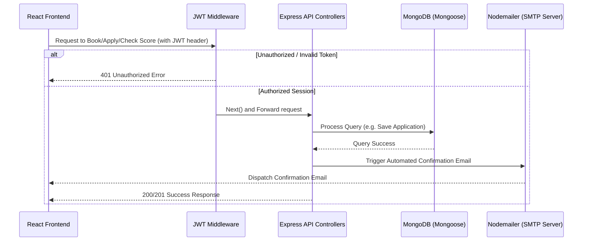

<h1 align="center">🏦 CS Smart Finserve</h1>

<p align="center">
  <strong>Smart Finance. Trusted Partners.</strong>
</p>

<p align="center">
  
  
  
  
  
  
  
</p>

---

## 🌟 Introduction

**CS Smart Finserve** is a production-ready, full-stack financial technology platform designed to streamline loan applications, lead collection, credit eligibility assessment, and client relationship management. 

Built with the **MERN (MongoDB, Express, React, Node)** stack, this application incorporates advanced responsive user experience, state-of-the-art security patterns, background notifications, and administrative tracking tools, serving as a powerful case study for recruiters looking for full-stack engineering proficiency.

### 🎯 Key Design Criteria
- **Production-Grade Security**: Secure sessions utilizing JSON Web Tokens (JWT) and advanced middleware protection.
- **Micro-Animations & Responsive Visuals**: Interactive, modern UI leveraging Tailwind CSS, Framer Motion, and Chart.js.
- **Robust Network Reliability**: Custom Axios client with exponential backoff retry algorithms to handle network flickers and hosting platform (e.g., Render) cold starts.
- **Automated Workflow**: Real-time notifications sent dynamically using HTML email templates on application status updates.

---

## 🗺️ System Architecture



---

## 🚀 Core Features

### 🖥️ Client Experience (Frontend)
*   **Dynamic Loan & Insurance Landing Portlets**: Custom information portals for Home, Business, Auto, Personal, and LAP (Loan Against Property) products.
*   **Interactive EMI Calculator**: Real-time loan calculation showing amortized summaries and visually supported by dynamic charts powered by `Chart.js`.
*   **Instant Credit Rating (CIBIL) Simulator**: User eligibility calculator with validation checking.
*   **Unified Client Engagement Forms**: Easy callback scheduling and appointment manager (disallowing Sunday slots to fit standard operational hours).
*   **Modern Branding & Visuals**: Sleek dark/light theme switching, sticky glassmorphic navigation menus, and floating WhatsApp support channels.

### ⚙️ Engine Room (Backend & Admin)
*   **State-of-the-art Security**: Encrypted server-client data transits, request limit throttle middleware, and comprehensive payload validation checks.
*   **Admin Command Center**: A secure admin-only command page to monitor system statistics, filter applications, update statuses (e.g., *Submitted*, *Under Review*, *Approved*, *Rejected*, *Disbursed*), and search metrics globally.
*   **Nodemailer Trigger System**: Automated notifications dispatching HTML templates on appointment scheduling, callback logs, and loan application transitions.

---

## 📂 Project Structure

```
cs-smart-finserve/
├── backend/
│   ├── controllers/            # Controller logic for authentication, admin panels, and forms
│   ├── middleware/             # JWT auth validation & role authorization checks
│   ├── models/                 # Mongoose schemas (User, Application, Lead, Appointment, Cibil)
│   ├── routes/                 # REST API routers matching backend controllers
│   ├── utils/                  # Nodemailer utility configurations & HTML templates
│   └── server.js               # Express application entry-point
├── frontend/
│   ├── public/                 # HTML templates, assets, sitemaps, and manifest.json
│   ├── src/
│   │   ├── components/         # Reusable dashboard widgets, layout headers/footers
│   │   ├── context/            # React Context stores for Auth & Theme state
│   │   ├── pages/              # Application page controllers (Home, Calculators, Portals)
│   │   ├── utils/              # Axios instance configurations with retry interceptors
│   │   └── App.js              # Application client-side router configuration
│   └── package.json            # Client dependencies and build configurations
└── package.json                # Project root dependency manifest & scripts
```

---

## 🔐 Security Audit & Architecture

We built security directly into the framework of the application to comply with standards:
*   **JWT Token Authorization**: Client state is validated on each query. If the session expires or is modified, Axios interceptors clear local storage and force re-authentication.
*   **Password Hashing**: Uses `bcryptjs` utilizing a salt difficulty of 12 rounds on user signups and resets.
*   **HTTP Protection Headers**: Integrates `helmet` middleware to enforce web standard headers.
*   **Anti-Spam & Rate Limiting**: Limit-throttling routes to maximum 100 requests per 15 minutes to mitigate brute-force and scraping scripts.
*   **Payload Sanitization**: Uses `express-validator` to sanitize and confirm email patterns, phone digits, and credit consent before persistence.

---

## 📊 Database Entity Model

Mongoose schemas represent structured tables linked via operational states:

| Collection | Model Fields | Integrity Validations & Enums | Purpose |
| :--- | :--- | :--- | :--- |
| **Users** | `name`, `email`, `phone`, `password`, `role`, `resetPasswordToken` | Hashed password, Roles: `['user', 'admin']` | Session tracking, access rights validation. |
| **Leads** | `fullName`, `phone`, `email`, `serviceInterested`, `status`, `message` | Status: `['new', 'contacted', 'qualified', 'converted', 'closed']` | Stores client contact request pipelines. |
| **Appointments** | `fullName`, `phone`, `email`, `preferredDate`, `preferredTime`, `service`, `status` | Date restriction rules, Status: `['pending', 'confirmed', 'completed', 'cancelled']` | Schedules in-branch consult appointments. |
| **Applications** | `fullName`, `email`, `phone`, `serviceType`, `loanAmount`, `employmentType`, `monthlyIncome`, `panNumber`, `address`, `status` | Validate PAN structures, Status: `['submitted', 'under-review', 'approved', 'rejected', 'disbursed']` | Full credit profiles submitted for processing. |
| **CibilChecks** | `name`, `pan`, `dob`, `mobile`, `email`, `consent`, `status` | Boolean consent flags, PAN validation structures | Credit simulation logs. |

---

## 💡 Code Highlights

### 1. Robust Network Interceptor (Frontend Retry + Cold Start Management)
To bypass cold starts on free cloud servers and handle erratic networks, a custom Axios interceptor executes automatic retries with exponential backoffs:
```javascript
// frontend/src/utils/api.js
api.interceptors.response.use(
  (response) => response,
  async (error) => {
    const config = error.config;
    
    // Retry on network errors, timeouts, or 5xx server errors
    if (isRetryableError(error) && config.retryCount < MAX_RETRIES) {
      config.retryCount += 1;
      
      // Wait before retrying (exponential backoff)
      await wait(RETRY_DELAY * config.retryCount);
      
      return api(config); // Retry original request
    }
    
    return Promise.reject(error);
  }
);
```

### 2. Authorization Guards (Backend Middleware)
Securing routes is accomplished via decoupled validation hooks checking token integrity:
```javascript
// backend/middleware/auth.js
exports.protect = async (req, res, next) => {
  try {
    let token = req.headers.authorization?.startsWith('Bearer') && req.headers.authorization.split(' ')[1];

    if (!token) return res.status(401).json({ success: false, message: 'Not authorized' });

    try {
      const decoded = jwt.verify(token, process.env.JWT_SECRET);
      req.user = await User.findById(decoded.id).select('-password');
      if (!req.user) return res.status(401).json({ success: false, message: 'User not found' });
      next();
    } catch {
      return res.status(401).json({ success: false, message: 'Token failed' });
    }
  } catch (error) {
    res.status(500).json({ success: false, message: 'Server authentication failure' });
  }
};
```

---

## 📦 Getting Started

### Prerequisites
*   **Node.js**: v18.x or newer
*   **MongoDB**: Local cluster or Atlas Cloud cluster
*   **SMTP Mail Provider**: Setup credentials for email dispatches

### Clone & Install
```bash
# Clone the repository
git clone <your-repository-url>
cd cs-smart-finserve

# Install workspace dependencies (both Frontend & Backend)
npm run install-all
```

### Configuration Setup
Create a `.env` file in the root directory (based on `.env.example`):
```env
PORT=5001
MONGO_URI=mongodb+srv://<username>:<password>@cluster.mongodb.net/csfinserve
JWT_SECRET=your_super_secure_jwt_secret_token
EMAIL_SERVICE=gmail
EMAIL_USER=your_gmail_address@gmail.com
EMAIL_PASS=your_gmail_app_password
CLIENT_URL=http://localhost:3000
ADMIN_EMAIL=admin@cssmartfinserve.com
```

### Start Development
```bash
# Spin up both Frontend and Backend concurrently
npm run dev
```
*   **Frontend Client**: http://localhost:3000
*   **Backend Server**: http://localhost:5001

---

## 🚀 Production Deployment

### Backend (Render, Railway, Heroku)
The root `package.json` contains scripts to coordinate backend setups:
```bash
npm install
npm run server
```

### Frontend (Vercel, Netlify)
Ensure standard single-page app redirects rule parameters are defined:
```bash
cd frontend
npm install
npm run build
```

---

## 👨‍💻 Developer & Contact

For questions, code reviews, or business proposals:
*   **Corporate Email**: info@cssmartfinserve.com
*   **Locations**: Gurugram | Karol Bagh (Delhi) | Faridabad
*   **Licensing**: Distributed under the [MIT License](LICENSE).
